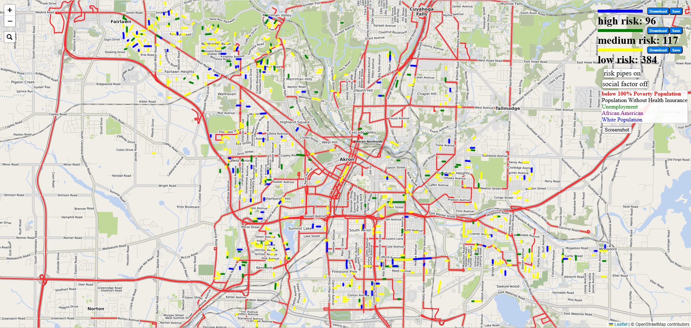

# GIS-visualization-for-water-pipe-failure-prediction

This repository provides a visualization system for **water pipe break prediction**.  
It integrates machine learning prediction results with geographic visualization, allowing users to view and analyze pipe break risks on an interactive map.

---

## 🧠 Project Overview

This tool is designed to:
- Visualize **predicted pipe failure risk** on a map
- Support **interactive exploration** of water pipe networks
- Help decision-makers understand spatial risk distribution

---

## ⚙️ Installation Guide

### 🐍 1. Install Python 3.11
Make sure you have **Python 3.11** installed on your system.  
You can download it from the official website:  
🔗 [https://www.python.org/downloads/release/python-3119/](https://www.python.org/downloads/release/python-3119/)

Check version after installation:
```bash
python --version
```

### 🧩 2. Set Up the Virtual Environment and Install GDAL
Create and activate a virtual environment:
```bash
py -3.11 -m venv .venv
.venv\Scripts\activate
```

Then install the GDAL wheel file (make sure to use the correct version for your system)
```bash
pip gdal-3.11.1-cp311-cp311-win_amd64.whl
```

### 📦 3. Install Required Python Packages
```bash
pip install -r requirement.txt
```

### 🚀 4. Run the Application
Start the Flask application:
```bash
flask run
```
## 🖼️ Application Overview


## 👨‍💻 Author

**[Wenjing Yang]**  
Ph.D. Researcher in Mechanical Engineering  
Focus: Machine Learning · Water Systems · Data Visualization  
Affiliation: university of akron 
Email: wy18@uakron.edu
GitHub: [https://github.com/scuaaa](https://github.com/scuaaa)